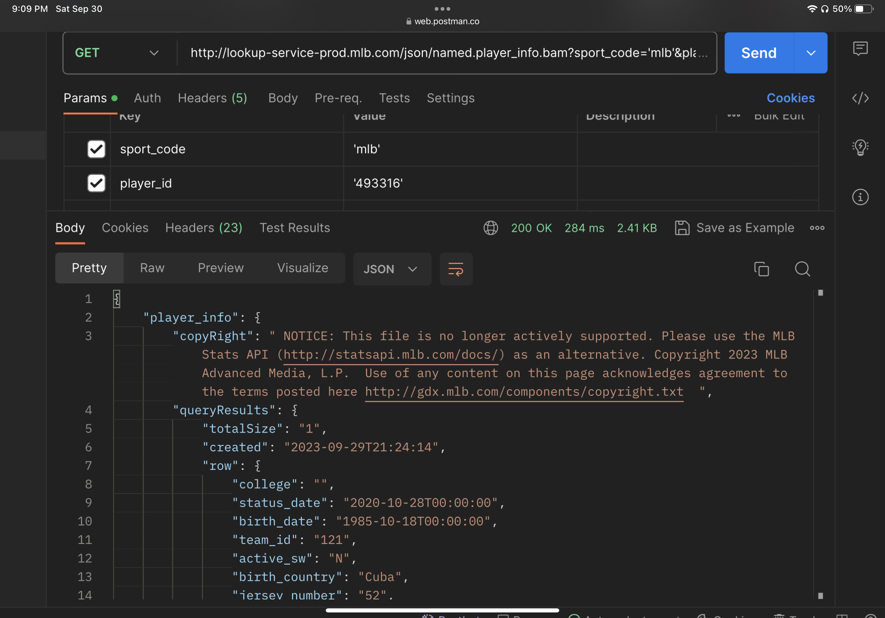

# Week3-Exploring_APIs

## Project Domain and Application Description
The domain of out project is sabermetrics, or the statistical analysis of baseball. The goal of sabermetrics is to use 
the wealth of data available on baseball players and their performance to be able to make accurate predictions. The
data available for baseball is expansive, and includes everything from the age of players, their hitting stats for a 
given season, their projected stats for future seasons, or all the players who are currently injured. The goal of our
project is to present this data in an accessible manner for users. Since this data is of interest to many groups of
(fans of teams, sports better, fantasy baseball players, etc.), the data will be searchable and presentable in
different ways, with the ability to put onto the screen multiple data sets to compare. 

## API Information
The API that we will use for this project is the MLB data API.

Link to documentation: https://appac.github.io/mlb-data-api-docs/#top

Screenshot of trying API: 

## Example Java Code
Here is an example of using the API:
```
OkHttpClient client = new OkHttpClient().newBuilder()
                .build();
        MediaType mediaType = MediaType.parse("text/plain");
        Request request = new Request.Builder()
                .url("http://lookup-service-prod.mlb.com/json/named.player_info.bam?sport_code='mlb'&player_id='493316'")
                .method("GET", null)
                .build();
        Response response = client.newCall(request).execute();
        System.out.println(response.body().string());
```

Which prints out:
```
{"player_info":{"copyRight":" NOTICE: This file is no longer actively supported. Please use the MLB Stats API (http://statsapi.mlb.com/docs/) as an alternative. Copyright 2023 MLB Advanced Media, L.P.  Use of any content on this page acknowledges agreement to the terms posted here http://gdx.mlb.com/components/copyright.txt  ","queryResults":{"totalSize":"1","created":"2023-10-01T02:17:27","row":{"college":"","status_date":"2020-10-28T00:00:00","birth_date":"1985-10-18T00:00:00","team_id":"121","active_sw":"N","birth_country":"Cuba","jersey_number":"52","twitter_id":"@ynscspds","name_nick":"La Potencia","name_display_last_first":"Cespedes, Yoenis","primary_position_txt":"LF","name_display_roster_html":"Cespedes","weight":"225","throws":"R","team_name":"New York Mets","death_date":"","name_middle":"","team_abbrev":"NYM","height_feet":"5","status":"Free agent","end_date":"2020-10-29T00:00:00","pro_debut_date":"2012-03-28T00:00:00","birth_city":"Granma","status_code":"FA","gender":"M","name_full":"Cespedes, Yoenis","name_title":"","name_display_first_last":"Yoenis Cespedes","height_inches":"11","name_matrilineal":"Milanes","name_last":"Cespedes","birth_state":"","name_display_last_first_html":"Cespedes, Yoenis","bats":"R","name_prefix":"","player_id":"493316","file_code":"nym","primary_sport_code":"","primary_position":"7","name_display_first_last_html":"Yoenis Cespedes","start_date":"2016-11-30T00:00:00","death_city":"","name_first":"Yoenis","name_use":"Yoenis","death_country":"","high_school":"","team_code":"nyn","death_state":"","name_display_roster":"Cespedes","primary_stat_type":"hitting","age":"38"}}}}
```
Which is the available data on the player Yoenis Cespedes. 

## Technical Issues:
1: Received 502 Bad Gateway Errors on a specific type if request
